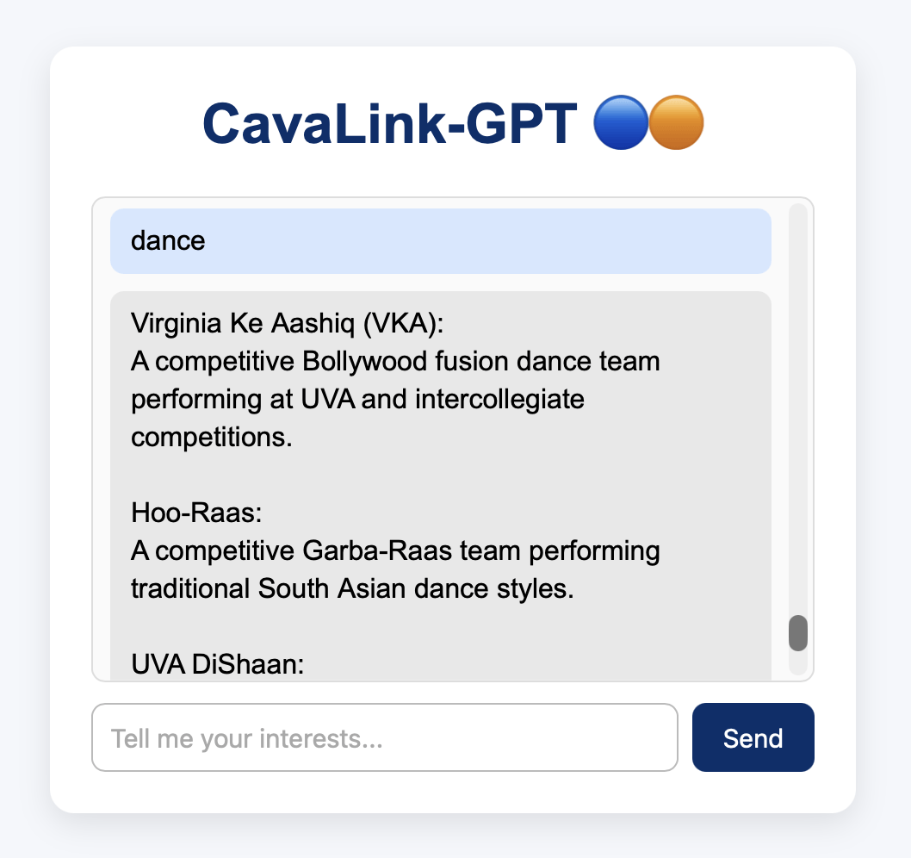
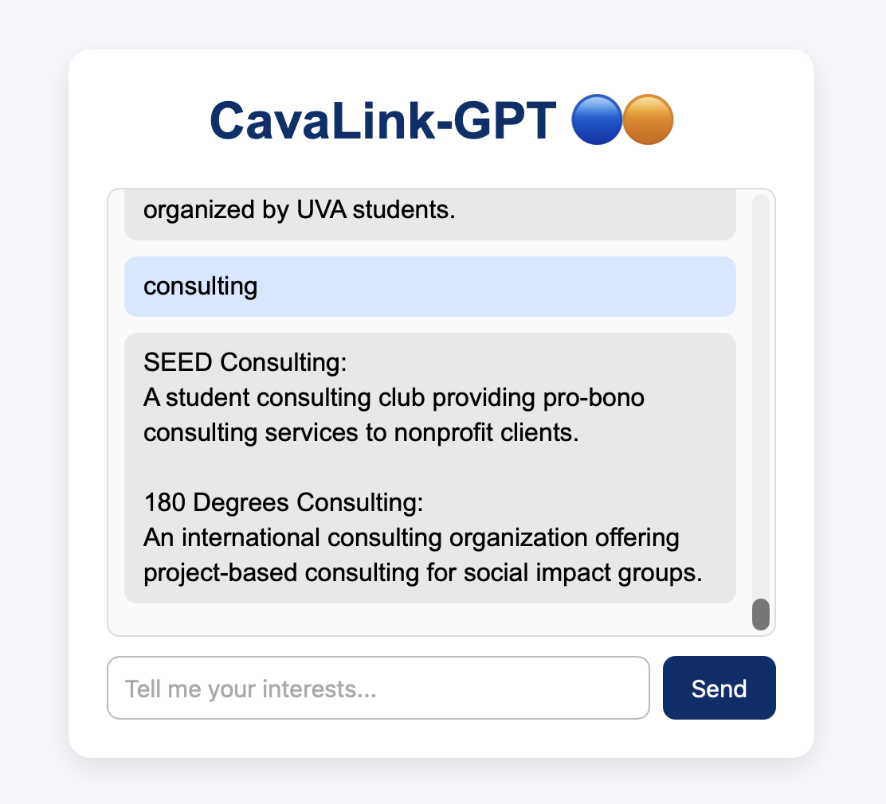

# FINAL CASE STUDY WRITE UP

## EXECUTIVE SUMMARY
1) Problem: UVA has hundreds of student organizations, but most first-years—and many upper-class students—struggle to find clubs that actually match their interests. Browsing long lists on HoosInvolved is overwhelming, out-of-date, and not personalized. Students want a simple way to discover communities that fit their hobbies, identities, and goals.
2) Solution: CavaLink-GPT is a chatbot UVA club-recommender. It uses a Flask API and rule-based retrieval to generate conversational, personalized club suggestions. Students describe what they enjoy (“I like dance and consulting”), and the system returns tailored matches from club data using keyword matching. Everything runs locally inside Docker for portability and reproducibility.

## HOW TO PROMPT THE CHATBOT
Prompt CavaLink-GPT with a single keyword, like "dance", "consulting", or "journalism"!

## SYSTEM OVERVIEW
Course Concept(s): REST APIs (Flask), Containerization (Docker), Frontend to Backend integration

Architecture Diagram: 


Data/Models/Services: 

The primary data source for this project is a manually created JSON file, assets/clubs.json, which contains structured information about student organizations at UVA that was manually pulled from the organizations section on the Hoos Involved website. The file includes each club’s name, category, tags, and description, allowing the system to understand relevant attributes such as academic focus, cultural affiliation, performance type, or general interests. Because the dataset is fully custom-built and locally stored, it has no external licensing restrictions and remains lightweight, easy to load, and simple to maintain.

My project does not use any external machine learning models or LLMs. Instead, the system relies on a deterministic, rule-based keyword-matching model implemented directly in Flask. When a user submits text, the backend scans the query for keywords and compares them against the club’s name, category, tags, and description. Any club containing a matching keyword is returned as a recommendation. This approach ensures zero hallucinations, full transparency, and consistent results while avoiding the complexity or cost of external APIs. The backend Flask API is responsible for parsing user input, performing the search, and returning structured JSON responses, while a lightweight frontend interface handles user interaction.

## HOW TO RUN

Please run locally! 
```
docker build -t cavalink-gpt .
docker run --rm -p 5000:5000 cavalink-gpt
# health Check
curl http://localhost:5000/health
```


## DESIGN DECISIONS
This project uses a simple keyword-matching system because it is the easiest, most reliable way to recommend clubs without relying on large models or external services. The Flask backend takes whatever the user types, compares those words to the club names, categories, tags, and descriptions in the clubs.json file, and returns any clubs that match. This approach keeps the system fast, predictable, and easy to understand. Since the data is stored locally in one small JSON file, there’s nothing complicated to set up, no internet dependency, and no risk of the model making things up and hallucinating clubs that do not exist. When I was using Ollama, my chatbot kept hallucinating and making a lot of spelling errors, which was really difficult to troubleshoot.

More advanced options—like using an LLM, embeddings, or a database—were not chosen because they add complexity without improving results for such a small dataset. The current design is easy to maintain: adding a new club only requires adding one entry to the JSON file, and the matching system automatically picks it up. Security concerns are minimal since no user data is stored and there are no secret keys or APIs involved. The system also runs cleanly inside Docker and is simple to debug, with the only main limitation being that keyword matching cannot understand deeper meaning or context like an AI model would—but this tradeoff is acceptable for this project’s scope.


## RESULTS AND EVALUATION



## WHAT'S NEXT
- Expand the club dataset by adding more organizations and richer tags so recommendations become more accurate and comprehensive.
- Improve keyword extraction with simple NLP techniques (tokenization, stop-word removal, stemming) to better interpret user input.
- Add better scoring logic to rank clubs using weighted matches instead of simple counts.
- Improve error handling for empty inputs, unclear queries, or malformed frontend requests.
- Add a search UI with real-time suggestions (typeahead / autocomplete).
- Allow multi-step conversations so the system can ask clarification questions (“Are you looking for competitive or social dance clubs?”).
- Enable personalization by letting users “like” or “save” recommended clubs.
- Deploy to the cloud (Render, Fly.io, or GitHub Pages + backend hosting) for public demos outside of Docker.
- Create an admin dashboard for adding/editing club info through a simple interface rather than editing Python files.

## LINKS 

GitHub Repo: https://github.com/dishidhak/cavalink-gpt.git
